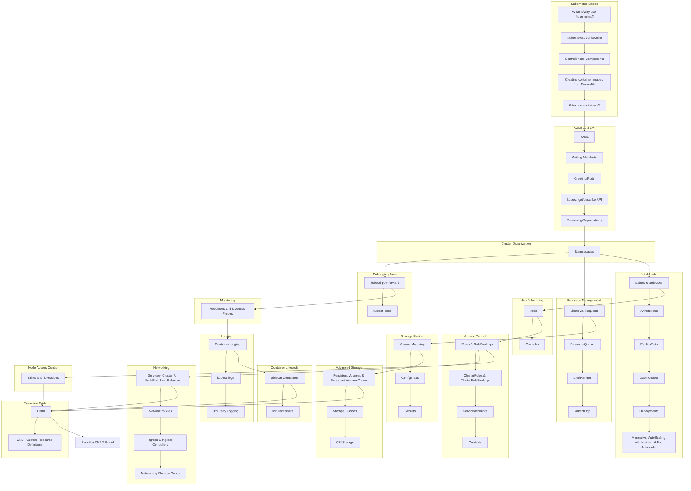

```mermaid
graph TD
    subgraph Kubernetes Basics
        A[What is/why use Kubernetes?] --> B[Kubernetes Architecture]
        B --> C[Control Plane Components]
        C --> D[Creating container images from Dockerfile]
        D --> E[What are containers?]
    end

    subgraph YAML and API
        F[YAML] --> G[Writing Manifests]
        G --> H[Creating Pods]
        H --> I[kubectl get/describe API]
        I --> J[Versioning/Deprecations]
    end

    subgraph Resource Management
        K[Limits vs. Requests] --> L[ResourceQuotas]
        L --> M[LimitRanges]
        M --> N[kubectl top]
    end

    subgraph Access Control
        O[Roles & RoleBindings] --> P[ClusterRoles & ClusterRoleBindings]
        P --> Q[ServiceAccounts]
        Q --> R[Contexts]
    end

    subgraph Logging
        S[Container logging] --> T[kubectl logs]
        T --> U[3rd Party Logging]
    end

    subgraph Storage Basics
        V[Volume Mounting] --> W[Configmaps]
        W --> X[Secrets]
    end

    subgraph Advanced Storage
        Y[Persistent Volumes & Persistent Volume Claims] --> Z[Storage Classes]
        Z --> AA[CSI Storage]
    end

    subgraph Container Lifecycle
        AB[Sidecar Containers] --> AC[Init Containers]
    end

    subgraph Workloads
        AD[Labels & Selectors] --> AE[Annotations]
        AE --> AF[ReplicaSets]
        AF --> AG[DaemonSets]
        AG --> AH[Deployments]
        AH --> AI[Manual vs. AutoScaling with Horizontal Pod Autoscaler]
    end

    subgraph Job Scheduling
        AJ[Jobs] --> AK[Cronjobs]
    end

    subgraph Networking
        AL[Services- ClusterIP, NodePort, LoadBalancer] --> AM[NetworkPolicies]
        AM --> AN[Ingress & Ingress Controllers]
        AN --> AO[Networking Plugins- Calico]
    end

    subgraph Debugging Tools
        AP["kubectl port-forward"] --> AQ["kubectl exec"]
    end

    subgraph Monitoring
        AT["Readiness and Liveness Probes"]
    end

    subgraph Cluster Organization
        AU["Namespaces"]
    end
    
    subgraph Node Access Control
        AV["Taints and Tolerations"]
    end

    subgraph Extension Tools
        AR[Helm] --> AS[CRD - Custom Resource Definitions]
    end

    E --> F
    J --> AU
    AU --> AP
    AU --> K
    AU --> AD
    AP --> AT
    AT --> S
    S --> AB
    K --> V
    V --> Y
    AD --> AJ
    AJ --> O
    O --> AL
    O --> AV
    AL --> AR
    AV --> AR
    Y --> AR
    AB --> AR
    AR --> AX["Pass the CKAD Exam!"]
```
